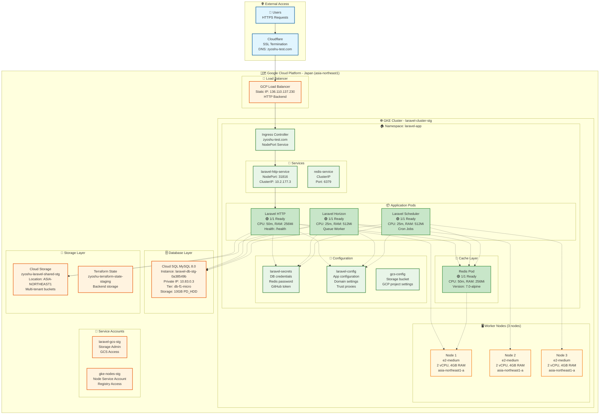

# Laravel GKE Infrastructure Diagram - Japan Region

## 🏗️ Architecture Overview

## 📊 Resource Summary

### 💰 Cost Breakdown (Monthly)
| Component | Type | Cost |
|-----------|------|------|
| **GKE Cluster** | 3 × e2-medium nodes | ~$60-80 |
| **Cloud SQL** | db-f1-micro + 10GB | ~$15-20 |
| **Static IP** | Global external IP | ~$5 |
| **Storage** | GCS + Terraform state | ~$2-5 |
| **~~Redis VM~~** | ~~e2-small~~ | ~~$0~~ (Removed) |
| **Total** | | **~$82-110/month** |

### 🎯 Performance Characteristics
- **Latency**: < 50ms (Japan region)
- **Availability**: 99.9% (multi-node setup)
- **Scalability**: Auto-scaling 1-3 nodes
- **Storage**: Multi-tenant GCS buckets
- **Queue Processing**: Redis-based with Horizon

### 🔧 Key Features
- ✅ **Multi-tenant Architecture**: Subdomain routing ready
- ✅ **Auto-healing**: Kubernetes manages all components
- ✅ **Cost-optimized**: Staging configuration with minimal resources
- ✅ **SSL Ready**: Cloudflare handles HTTPS termination
- ✅ **Monitoring**: Health checks on all components
- ✅ **Persistent Data**: Cloud SQL + GCS storage

### 🌐 Network Flow
1. **User** → `https://zyoshu-test.com`
2. **Cloudflare** → SSL termination → HTTP
3. **GCP Load Balancer** → `136.110.137.230`
4. **Kubernetes Ingress** → Routes to service
5. **NodePort Service** → Distributes to pods
6. **Laravel Pods** → Process requests
7. **Redis Pod** → Caching & queues
8. **Cloud SQL** → Database operations
9. **GCS** → File storage

### 🔄 Data Flow
- **HTTP Requests**: User → Cloudflare → Load Balancer → Ingress → HTTP Pod
- **Queue Jobs**: HTTP Pod → Redis → Horizon Pod → Processing
- **Scheduled Tasks**: Scheduler Pod → Executes cron jobs
- **Database**: All pods → Cloud SQL (private IP)
- **File Storage**: All pods → GCS buckets (multi-tenant)

---
*Generated: November 5, 2025*  
*Environment: Staging*  
*Region: Asia-Northeast1 (Tokyo, Japan)*
